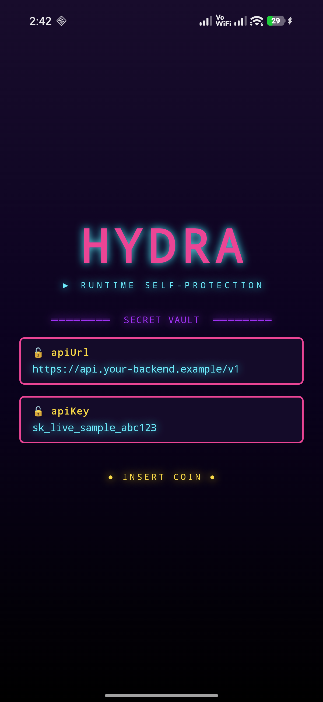

<!-- ════════════════════════════════════════════════════════════════════════ -->
<!--                          H Y D R A   ·   ARCADE                          -->
<!-- ════════════════════════════════════════════════════════════════════════ -->

<div align="center">


<a href="https://github.com/iamjosephmj/hydra">
  
</a>

<p>
  <a href="https://buymeacoffee.com/iamjosephmy"></a>
</p>

<p>
  
  
  <a href="https://jitpack.io/#iamjosephmj/hydra"></a>
  
  
</p>

<p>
  
  
  
  <a href="https://github.com/iamjosephmj/hydra/actions/workflows/release-apk.yml"></a>
</p>

```
        ╔═══════════════════════════════════════════════════════════════════╗
        ║   ▶ P1   ROOT ▰▰  HOOK ▰▰  CLONE ▰▰  VIRT ▰▰  EMU ▰▰  TAMPER ▰▰   ║
        ║                                                        1 CREDIT   ║
        ╚═══════════════════════════════════════════════════════════════════╝
```

### `🕹️  A Gradle-plugin RASP for Android  🕹️`

Add it like any other build plugin and it **dynamically injects** a hardened
native protection layer straight into your APK — no security code, no SDK calls,
no servers. **Apply the plugin, build your app, and the output APK comes out
self-defending.**

<br>

🕹️ &nbsp; 👾 &nbsp; 🪙 &nbsp; ⚡ &nbsp; 🛡️ &nbsp; 🔒 &nbsp; 💥 &nbsp; 🎯 &nbsp; 🏆 &nbsp; 👾 &nbsp; 🕹️

</div>


## 👾 &nbsp; PLAYER GUIDE

Under the hood, applying hydra bakes a heavily OLLVM-obfuscated native core
(`libdicore.so`), a per-build integrity baseline, and a randomized bootstrap into
your APK. Protection starts at process creation and runs entirely on-device, in
native code.

## 🪙 &nbsp; PHILOSOPHY — *"SOME PROTECTION > NONE"*

Security on a device you don't control is never absolute. A determined,
well-resourced attacker with unlimited time can defeat any client-side
protection — anything that runs can eventually be observed and undone. hydra does
not pretend otherwise.

What it does is **raise the cost.** Most attacks are opportunistic and
tooling-driven; they move on when an app doesn't crack open in five minutes with
the usual tools. An unprotected app is trivially repackaged, hooked, and cloned;
a hydra-protected one forces an attacker through obfuscated native code,
self-verification, and unconditional enforcement first. That is *delay, not
denial* — and for most apps, delay is what changes the economics.

It is also **friction-free.** Protection you can turn on with one plugin line is
protection that actually ships — hydra optimizes for *"good protection, applied"*
over *"perfect protection, skipped."*


## 🛡️ &nbsp; SELECT YOUR DEFENSE

<div align="center">

| 🛡️ | 🪝 | 👯 | 👾 | 🔏 | 🧬 |
|:--:|:--:|:--:|:--:|:--:|:--:|
| **ROOT** | **HOOKING** | **CLONE / VIRTUAL** | **EMULATOR** | **INTEGRITY** | **HARDENING** |
| `▰▰▰▰▰` | `▰▰▰▰▰` | `▰▰▰▰▰` | `▰▰▰▰▰` | `▰▰▰▰▰` | `▰▰▰▰▰` |
| 🟢 `ON` | 🟢 `ON` | 🟢 `ON` | 🟢 `ON` | 🟢 `ON` | 🟢 `ON` |

</div>

> All checks run **natively** at startup. A confirmed **CRITICAL** finding terminates the process — **lethal by default**, no advisory/observe mode. ⚠️ **GAME OVER** for tampered devices.


## 🛰️ &nbsp; ZERO TRACKING · GDPR-READY

hydra is **100% on-device**. It collects nothing, transmits nothing, and phones
no one home.

| ✔ | &nbsp; |
|:--:|:--|
| 🚫 | **No network calls.** The runtime declares **no `INTERNET` permission** — it *physically cannot* transmit. No telemetry, no analytics, no crash-reporting SDK, no "phone-home". |
| 📵 | **No identifiers.** No advertising ID, no device fingerprint sent anywhere, no user IDs, no cookies. |
| 🏠 | **Everything stays local.** Every check (root / hooking / cloning / virtualization / emulator / integrity) and the kill decision is computed **on the device** and never leaves it. |
| 🇪🇺 | **GDPR-ready.** hydra processes no personal data off-device and shares nothing with anyone — it adds **zero** data-collection or third-party data-sharing to your app. |

> [!NOTE]
> **`QUERY_ALL_PACKAGES` disclosure.** The vendored runtime declares the
> `android.permission.QUERY_ALL_PACKAGES` permission (it merges into your app via
> the AAR manifest). It is used **only on-device** to enumerate installed packages
> for tamper detection — the **app-cloning / virtual-space** check and detecting
> known **root / attestation-spoofer manager** apps (Magisk, KernelSU, etc.). The
> result feeds the local kill decision and is **never transmitted, stored, or
> shared** (the runtime has no `INTERNET` permission — it cannot send it anywhere).
>
> **If you publish on Google Play:** `QUERY_ALL_PACKAGES` is a *sensitive* permission.
> Because your APK will carry it, you must declare its use in the **Play Console**
> ("Manage all apps" / permission declaration) and justify it under an allowed use
> case — **anti-fraud / security and anti-abuse** applies here. Apps that carry it
> without an approved declaration can be rejected. If you cannot use it, you can
> strip it from the merged manifest (`tools:node="remove"`) and add a fixed
> `<queries>` list instead — at the cost of reduced cloning / root-manager coverage.


## ▶ 🪙 &nbsp; STAGE 1 — INSERT COIN (Download)

[](https://jitpack.io/#iamjosephmj/hydra)

Add the repository in your **`settings.gradle.kts`**:

```kotlin
pluginManagement {
    repositories {
        maven("https://jitpack.io")
        google()
        mavenCentral()
        gradlePluginPortal()
    }
}
```

## ▶ 🕹️ &nbsp; STAGE 2 — START GAME (Integrate)

Apply the plugin in your **app module's `build.gradle.kts`**:

```kotlin
plugins {
    id("com.android.application")
    id("com.github.iamjosephmj.hydra") version "2.0.0"
}
```

That's the **entire** integration. No dependency line, no `Hydra.init()`, no code
in your `Application` class. Your next `assembleRelease` produces a self-protecting
APK.

> [!IMPORTANT]
> 🔑 Your `release` build type must have a fully-resolved **`signingConfig`** —
> hydra re-signs the instrumented APK, so a build without a keystore will fail.

```kotlin
android {
    signingConfigs {
        create("release") {
            storeFile = file("your-release-key.jks")
            storePassword = System.getenv("KEYSTORE_PASSWORD")
            keyAlias = System.getenv("KEY_ALIAS")
            keyPassword = System.getenv("KEY_PASSWORD")
        }
    }
    buildTypes {
        release { signingConfig = signingConfigs.getByName("release") }
    }
}
```

<details>
<summary><b>⚙️ &nbsp;Optional config &amp; troubleshooting</b></summary>

<br>

```kotlin
hydra {
    verbose.set(true) // log the baking steps during the build
}
```

**Plugin id not resolving via JitPack?** Map it explicitly in `settings.gradle.kts`:

```kotlin
pluginManagement {
    resolutionStrategy {
        eachPlugin {
            if (requested.id.id == "com.github.iamjosephmj.hydra") {
                useModule("com.github.iamjosephmj.hydra:com.github.iamjosephmj.hydra.gradle.plugin:2.0.0")
            }
        }
    }
}
```

If you pin `dependencyResolutionManagement` to `FAIL_ON_PROJECT_REPOS`, also add
`maven("https://jitpack.io")` to its `repositories {}` block so the runtime AAR
resolves.

</details>


## ▶ 💎 &nbsp; BONUS STAGE — 🔐 SECRET VAULT

Keep sensitive strings (API URLs, header names, keys) out of your APK as
plaintext, and read them back in Kotlin. Each value is encrypted at build time
with a **fresh per-build key** that is **re-derived in the obfuscated native
runtime** at decrypt time — the key and the plaintext never touch `classes.dex`,
only ciphertext.

**1️⃣ Stash the secrets** 💾 in your app module's `build.gradle.kts`:

```kotlin
hydra {
    secrets {
        put("apiUrl", "https://api.your-backend.example/v1")
        put("apiKey", "sk_live_abc123")
    }
}
```

**2️⃣ Unlock them in Kotlin** 🔓 via the generated `Hydra` accessor — **off the
main thread** (it blocks until the device clears the first sweep):

```kotlin
import com.github.iamjosephmj.hydra.Hydra
import kotlinx.coroutines.Dispatchers
import kotlinx.coroutines.withContext

val url = withContext(Dispatchers.IO) { Hydra.secret("apiUrl") }
val key = withContext(Dispatchers.IO) { Hydra.secret("apiKey") }
httpClient.get(url) { header("X-Api-Key", key) }
```

`Hydra.secret(name)` returns the decrypted value at the point of use. In the
built APK, `classes.dex` holds **only ciphertext + the `Hydra.secret(...)` call**
— never the plaintext.

> [!IMPORTANT]
> **Sweep-gated (since `1.2.1`).** `Hydra.secret()` **blocks until the first
> detection sweep completes clean** (zero CRITICAL), then decrypts — the key is
> cryptographically bound to a secret the native runtime publishes *only* on a
> clean device. On a **rooted / hooked / emulated / cloned / tampered** device the
> process is killed before the sweep clears, so the plaintext **never
> materialises — not even for a frame**. Because it blocks, **call it off the main
> thread** (`Dispatchers.IO`); calling it on the UI thread can ANR.

> [!NOTE]
> This is *"no static plaintext"*, not a vault. On a clean device the decrypted
> value lives in memory at runtime, so a runtime hook *there* could read it —
> which is exactly what hydra's hooking/ART checks detect and kill. It removes the
> trivial `strings classes.dex` / jadx extraction and the "screenshot the secret
> on an emulator" path, and raises the bar; for high-value secrets, keep them
> server-side.


## ▶ 🗃️ &nbsp; BONUS STAGE — ENCRYPTED ASSETS

Same idea, for **bundled files**. Mark assets and their plaintext is stripped
from the APK — only ciphertext + a per-build seed ship. They decrypt at runtime
through the same **sweep-gated** key, so a compromised device is killed before an
asset ever decrypts.

**1️⃣ List the assets** 💾 (paths relative to `assets/`):

```kotlin
hydra {
    encryptAssets { include("config.json", "models/model.tflite") }
}
```

**2️⃣ Read the bytes** 🔓 via `Hydra.asset(context, name)` — **off the main
thread** (it blocks until the first clean sweep, exactly like `Hydra.secret`):

```kotlin
val bytes = withContext(Dispatchers.IO) { Hydra.asset(context, "config.json") }
val config = String(bytes)   // your decrypted file
```

In the built APK there is **no plaintext `config.json`** — only an encrypted blob
under `assets/di/aenc/` and a manifest. The cipher reuses the runtime's existing
hash + whitebox key path (SHA-256 counter mode + HMAC-SHA256, keyed by the
sweep-gated native key — no stock AES), so the key is never shipped and the bytes
are integrity-checked on decrypt.


## ▶ 📦 &nbsp; BONUS STAGE — APP BUNDLE (bundle mode)

Shipping an **Android App Bundle (`.aab`)** through Play? Google splits,
re-encodes, and re-signs your APKs on the way to the device, which would make a
normal byte-for-byte APK check false-positive. Turn on **bundle mode** instead —
integrity that survives Play's pipeline:

```kotlin
hydra {
    appBundle {
        enabled = true
        // Play App Signing re-signs delivered APKs with the app signing key, so
        // pin its SHA-256 (Play Console → App integrity → App signing key
        // certificate). Your upload-key signer is added automatically.
        playSigningCertSha256("AB:CD:EF:...")
    }
}
```


## 💀 &nbsp; GAME OVER SCREEN (on-device behavior)

On a **tampered / rooted / hooked / cloned / emulated / virtualized** device, the
process is **terminated at startup** — an organic-looking native crash. That
includes emulators and **app-cloning / virtual-space** runtimes. On a **genuine**
device nothing is flagged and the app runs normally. Expect a baked APK to crash
on a rooted, emulated, or virtualized test device — that's the RASP working as
intended.

## 🎮 &nbsp; TRY THE DEMO

A minimal, runnable host app lives in [`sample/`](sample).

- It declares two `secrets {}` at build time.
- It displays them **decrypted at runtime** via `Hydra.secret(...)`.
- The plaintext is **never** in `classes.dex` — yet it shows up on screen.
- Real device, real round-trip:

<div align="center">
  
</div>

```bash
./gradlew :sample:assembleRelease
# → sample/build/outputs/apk/release/sample-release.apk   (RASP-protected)
```


## 🏆 &nbsp; HIGH SCORES

<div align="center">

[](https://star-history.com/#iamjosephmj/hydra&Date)

### Find this library useful? :heart:

Join the **[stargazers](https://github.com/iamjosephmj/hydra/stargazers)** :star: &nbsp;·&nbsp; **[follow me](https://github.com/iamjosephmj)** for the next creation 🤩

</div>


## 📜 &nbsp; LICENSE

**[Creative Commons Attribution-NoDerivatives 4.0 International (CC BY-ND 4.0)](LICENSE)**

```text
Copyright (c) 2026 Joseph James

You are FREE to USE hydra for any purpose — including COMMERCIALLY — and to
share VERBATIM copies, with attribution. You may fork and modify it for your
own use and to contribute back upstream, but you may NOT publish or distribute
MODIFIED versions.

Full terms: https://creativecommons.org/licenses/by-nd/4.0/
```

> [!NOTE]
> This is a **source-available** license, not an OSI open-source license — the
> *NoDerivatives* term intentionally forbids redistributing modified copies.
> Commercial use and verbatim redistribution are fully permitted.
